<p align="center">
  
</p>

<h1 align="center">👗 Fashion Retrieval Assignment</h1>

<p align="center">
  <a href="https://readme-typing-svg.herokuapp.com">
    
  </a>
</p>

<p align="center">
  <a href="https://www.python.org/"></a>
  <a href="https://pytorch.org/"></a>
  <a href="https://github.com/mlfoundations/open_clip"></a>
  <a href="https://huggingface.co/Salesforce/blip-image-captioning-base"></a>
  <a href="https://faiss.ai/"></a>
  <a href="https://huggingface.co/"></a>
  <a href="https://colab.research.google.com/"></a>
  
  
  <a href="LICENSE"></a>
</p>

<p align="center">
  <b>Text-to-image retrieval for fashion collections using zero-shot multimodal embeddings, exact vector search, BLIP captions, and hybrid retrieval.</b>
</p>

<p align="center">
  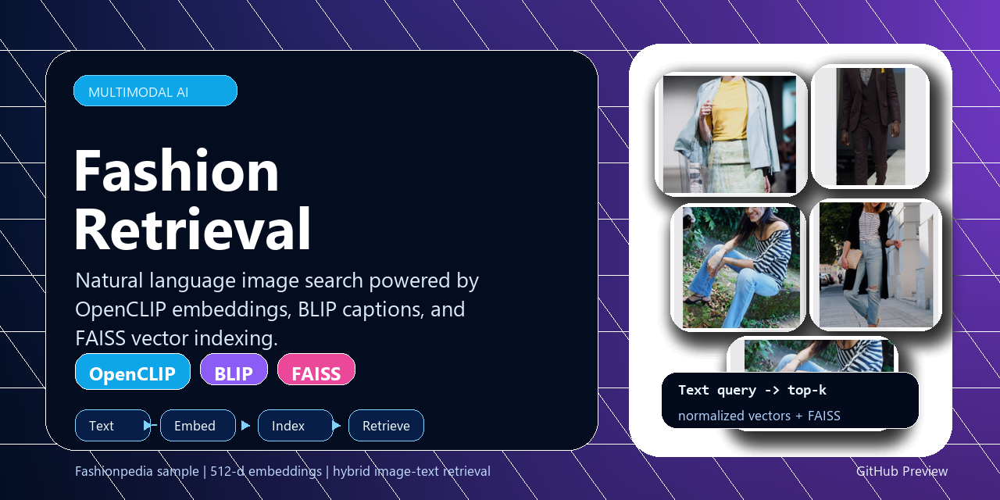
</p>

> [!IMPORTANT]
> The notebook is the source of truth for this project. The `src/` package extracts reusable helpers without replacing or changing the working ML pipeline.

---

<p align="center">
  
</p>

## ✨ Project Highlights

| Capability | What This Repository Provides |
| --- | --- |
| 🔎 Natural language retrieval | Search fashion images with descriptive text queries. |
| 🧠 OpenCLIP embeddings | Uses `ViT-B-32` with `laion2b_s34b_b79k` weights. |
| ⚡ FAISS indexing | Uses `IndexFlatIP` over normalized 512-dimensional embeddings. |
| 📝 BLIP captions | Generates captions with `Salesforce/blip-image-captioning-base`. |
| 🧬 Hybrid retrieval | Combines `0.7 * image_embedding + 0.3 * caption_embedding`. |
| 📓 Colab-first workflow | Original notebook remains fully preserved. |
| 🧩 Modular code | Reusable helpers in `src/models.py`, `src/indexer.py`, `src/retriever.py`, and `src/utils.py`. |
| 🖼️ Real sample outputs | Result images are extracted directly from notebook output cells. |

## 💡 Why This Project?

Fashion search is naturally visual and descriptive. A user may not know a product class label, but they can describe an outfit, setting, color, or style. This project demonstrates how modern multimodal models can bridge that gap by embedding images and text into a shared semantic space.

> “Search should understand how people describe what they see.”

This repository is designed to show practical ML engineering judgment: preserve a working research notebook, modularize reusable logic, document the architecture, and package the work clearly for internship review.

---

## 🧭 Table of Contents

- [Project Overview](#-project-overview)
- [Built With](#-built-with)
- [Architecture](#-architecture)
- [Workflow Diagram](#-workflow-diagram)
- [How It Works](#-how-it-works)
- [Dataset](#-dataset)
- [Installation](#-installation)
- [Usage](#-usage)
- [Example Queries](#-example-queries)
- [Sample Results](#-sample-results)
- [Repository Structure](#-repository-structure)
- [Report](#-report)
- [Roadmap](#-future-roadmap)
- [Acknowledgements](#-acknowledgements)
- [License](#-license)
- [Contact](#-contact)

---

## 🚀 Project Overview

This project retrieves fashion images from natural language queries such as:

- `Professional business attire inside a modern office`
- `Someone wearing a blue shirt sitting on a park bench`

It uses OpenCLIP to embed both images and text into a shared vector space, FAISS for nearest-neighbor search, BLIP to generate image captions, and a hybrid embedding strategy that combines OpenCLIP image embeddings with OpenCLIP embeddings of BLIP captions.

The implementation originated from a working Google Colab notebook:

```text
notebook/Fashion_Retrieval_Assignment.ipynb
```

The notebook remains preserved as the end-to-end experiment, while the `src/` package provides clean reusable helpers.

---

## 🧱 Built With

<table>
  <tr>
    <td align="center" width="25%">
      <br>
      <b>Python</b><br>
      <sub>Core programming language</sub>
    </td>
    <td align="center" width="25%">
      <br>
      <b>PyTorch</b><br>
      <sub>Model execution and tensors</sub>
    </td>
    <td align="center" width="25%">
      <br>
      <b>OpenCLIP</b><br>
      <sub>Image and text embeddings</sub>
    </td>
    <td align="center" width="25%">
      <br>
      <b>BLIP</b><br>
      <sub>Image caption generation</sub>
    </td>
  </tr>
  <tr>
    <td align="center" width="25%">
      <br>
      <b>FAISS</b><br>
      <sub>Vector similarity search</sub>
    </td>
    <td align="center" width="25%">
      <br>
      <b>Hugging Face</b><br>
      <sub>Model access</sub>
    </td>
    <td align="center" width="25%">
      <br>
      <b>Google Colab</b><br>
      <sub>Notebook runtime</sub>
    </td>
    <td align="center" width="25%">
      <br>
      <b>Matplotlib</b><br>
      <sub>Result visualization</sub>
    </td>
  </tr>
</table>

---

## 🏗️ Architecture

<p align="center">
  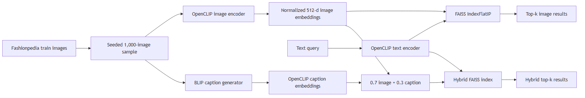
</p>

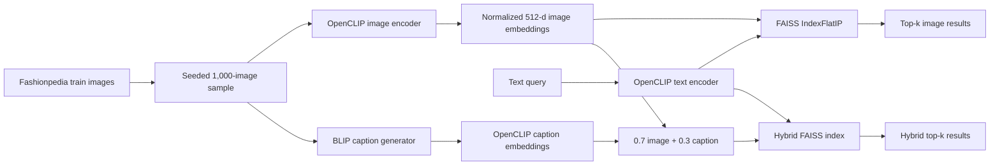

---

## 🔄 Workflow Diagram

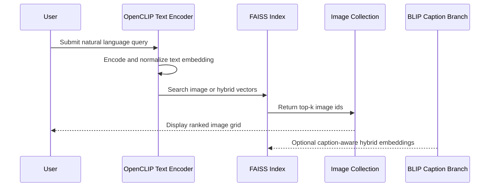

---

## 🧪 How It Works

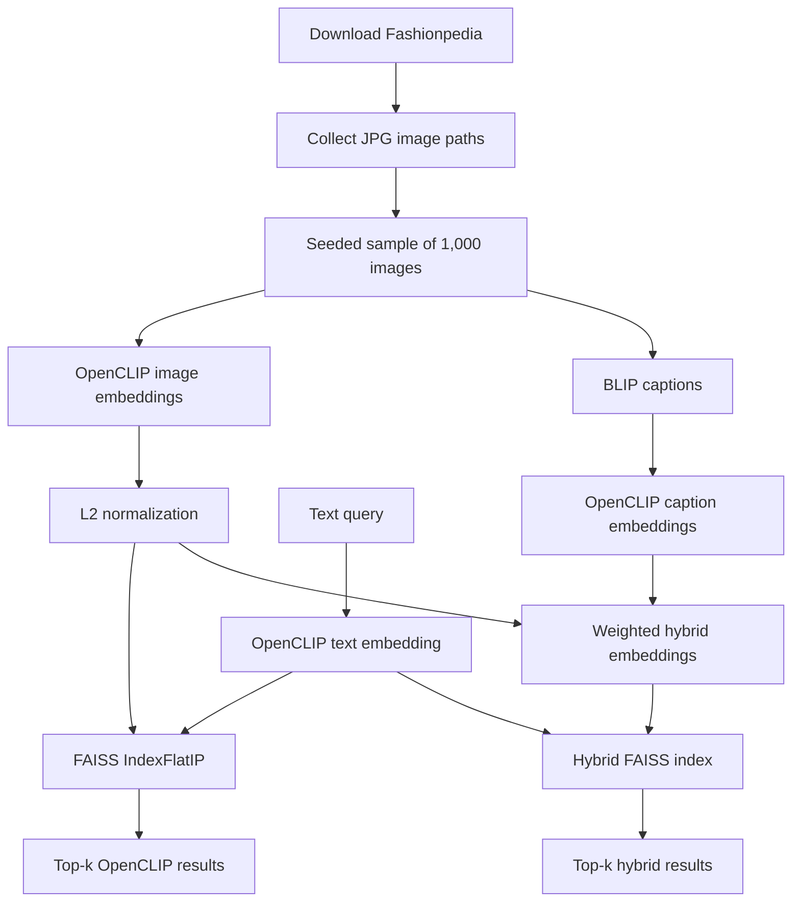

<details>
<summary><b>📌 Retrieval Pipeline Details</b></summary>

1. Download and unzip the Fashionpedia dataset in Colab.
2. Recursively collect `.jpg` files from the train split.
3. Select a seeded sample of 1,000 images.
4. Load OpenCLIP `ViT-B-32` with `laion2b_s34b_b79k` weights.
5. Encode each image and L2-normalize the embedding.
6. Build a FAISS `IndexFlatIP` index.
7. Encode a natural language query with OpenCLIP text encoding.
8. Retrieve the top-k nearest images by inner product.
9. Generate BLIP captions for images.
10. Encode captions with OpenCLIP text encoding.
11. Build normalized hybrid embeddings using the notebook's 0.7 image / 0.3 caption weighting.
12. Search the hybrid FAISS index with the same text query encoder.

</details>

---

## 📦 Dataset

The notebook downloads the Kaggle dataset `tpgd01/fashionpedia`.

| Dataset Detail | Value |
| --- | --- |
| Source | Kaggle dataset `tpgd01/fashionpedia` |
| Train path | `/content/fashionpedia/final_dataset/final_dataset/train` |
| Train images observed in notebook | `45,623` |
| Test images observed in notebook | `1,158` |
| Working sample size | `1,000` train images |
| Sampling seed | `42` |

> [!WARNING]
> Dataset licensing should be checked directly on Kaggle before redistribution or commercial use. The notebook output listed the dataset license as unknown.

---

## ⚙️ Installation

Clone the repository and install the Python dependencies:

```bash
pip install -r requirements.txt
```

For the notebook workflow, run in Google Colab with a Kaggle API token available as:

```text
kaggle.json
```

<details>
<summary><b>📋 Requirements</b></summary>

```text
torch
open_clip_torch
faiss-cpu
transformers
numpy
Pillow
matplotlib
tqdm
kaggle
```

</details>

---

## ▶️ Usage

The original workflow is preserved in the notebook:

```text
notebook/Fashion_Retrieval_Assignment.ipynb
```

Reusable module example:

```python
from src.indexer import build_image_embeddings, create_faiss_index
from src.models import load_openclip
from src.retriever import search_and_plot
from src.utils import list_image_paths, sample_paths

train_path = "/content/fashionpedia/final_dataset/final_dataset/train"
image_paths = sample_paths(list_image_paths(train_path), sample_size=1000, seed=42)

clip = load_openclip()
embeddings, valid_paths = build_image_embeddings(image_paths, clip)
index = create_faiss_index(embeddings)

search_and_plot(
    "Professional business attire inside a modern office",
    index=index,
    clip=clip,
    image_paths=valid_paths,
    top_k=5,
)
```

> [!TIP]
> Start with the notebook for the complete Colab flow, then use `src/` modules when you want cleaner reusable building blocks.

---

## 🔍 Example Queries

| Query |
| --- |
| `A person wearing a bright yellow raincoat` |
| `Professional business attire inside a modern office` |
| `Someone wearing a blue shirt sitting on a park bench` |
| `Casual weekend outfit for a city walk` |
| `A red tie and a white shirt in a formal setting` |

---

## 🖼️ Sample Results

The images below were extracted directly from existing notebook output cells. They are not fabricated, regenerated, or manually edited.

<p align="center">
  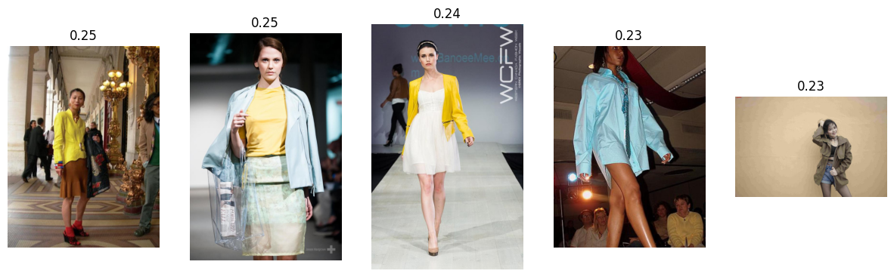
  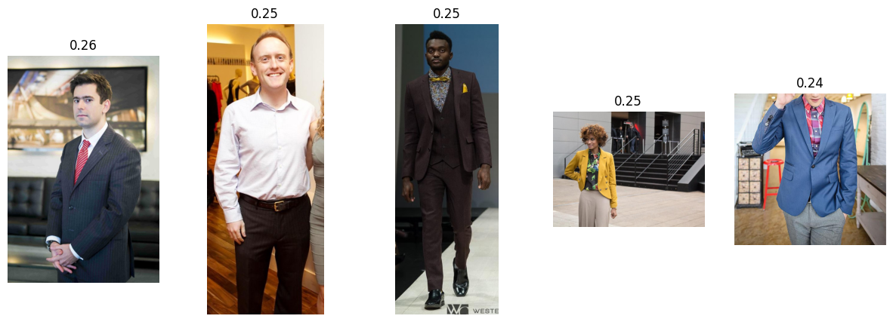
</p>

<p align="center">
  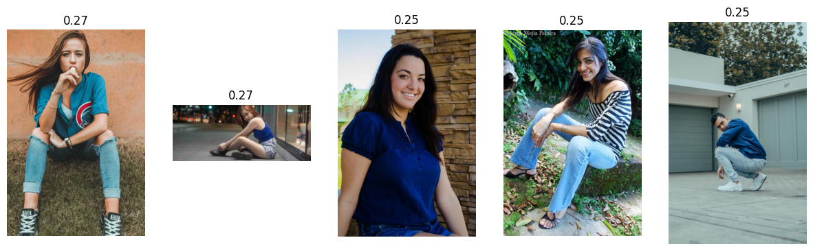
  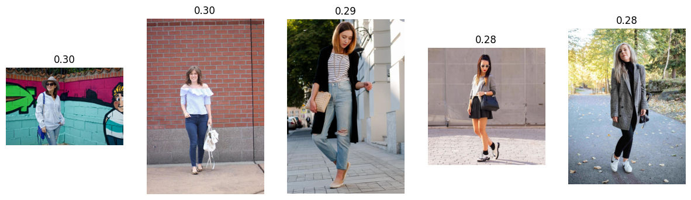
</p>

<p align="center">
  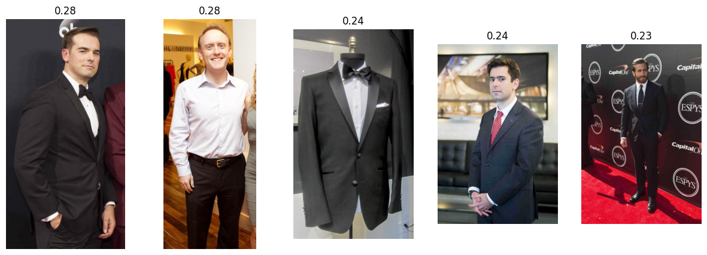
  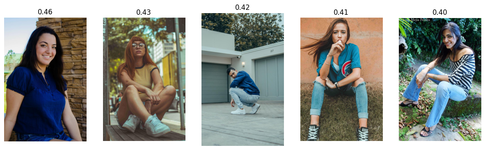
</p>

| Query | Mode | File |
| --- | --- | --- |
| A person wearing a bright yellow raincoat | OpenCLIP | [`sample_results/clip_yellow_raincoat.png`](sample_results/clip_yellow_raincoat.png) |
| Professional business attire inside a modern office | OpenCLIP | [`sample_results/clip_business_office.png`](sample_results/clip_business_office.png) |
| Someone wearing a blue shirt sitting on a park bench | OpenCLIP | [`sample_results/clip_blue_shirt_park_bench.png`](sample_results/clip_blue_shirt_park_bench.png) |
| Casual weekend outfit for a city walk | OpenCLIP | [`sample_results/clip_city_walk.png`](sample_results/clip_city_walk.png) |
| A red tie and a white shirt in a formal setting | OpenCLIP | [`sample_results/clip_red_tie_white_shirt.png`](sample_results/clip_red_tie_white_shirt.png) |
| Someone wearing a blue shirt sitting on a park bench | Hybrid | [`sample_results/hybrid_blue_shirt_park_bench.png`](sample_results/hybrid_blue_shirt_park_bench.png) |

<details>
<summary><b>🧾 Additional notebook-extracted result files</b></summary>

| File | Notebook Cell | Query | Mode |
| --- | --- | --- | --- |
| `clip_yellow_raincoat_v2.png` | 20 | `A person in a bright yellow raincoat` | OpenCLIP |
| `clip_business_office_v2.png` | 21 | `Professional business attire inside a modern office` | OpenCLIP |
| `clip_blue_shirt_park_bench_v2.png` | 22 | `Someone wearing a blue shirt sitting on a park bench` | OpenCLIP |
| `clip_city_walk_v2.png` | 23 | `Casual weekend outfit for a city walk` | OpenCLIP |

</details>

---

## 🗂️ Repository Structure

```text
fashion-retrieval/
├── notebook/
│   └── Fashion_Retrieval_Assignment.ipynb
├── src/
│   ├── __init__.py
│   ├── indexer.py
│   ├── models.py
│   ├── retriever.py
│   └── utils.py
├── sample_results/
│   ├── README.md
│   └── *.png
├── assets/
│   └── social-preview.png
├── architecture.png
├── report.md
├── report.pdf
├── README.md
├── requirements.txt
├── LICENSE
└── .gitignore
```

| Path | Purpose |
| --- | --- |
| `notebook/Fashion_Retrieval_Assignment.ipynb` | Preserved source-of-truth notebook |
| `src/models.py` | OpenCLIP and BLIP loading, encoding, and caption helpers |
| `src/indexer.py` | Embedding builders, FAISS indexes, hybrid embeddings |
| `src/retriever.py` | Text search and result plotting |
| `src/utils.py` | Path discovery, sampling, pickle helpers |
| `sample_results/` | Notebook-extracted retrieval plots |
| `assets/social-preview.png` | GitHub social preview image |
| `report.md` / `report.pdf` | Written project report |

---

## 📄 Report

The repository includes a written report covering:

- Problem statement
- Dataset
- Alternative approaches
- Chosen architecture
- Why OpenCLIP
- Why BLIP
- Hybrid retrieval
- FAISS indexing
- Evaluation
- Trade-offs
- Scalability to 1 million images
- Zero-shot retrieval
- Future work

Read it here:

- [`report.md`](report.md)
- [`report.pdf`](report.pdf)

---

## 🛣️ Future Roadmap

- [ ] Add quantitative evaluation with labeled query-image relevance judgments.
- [ ] Move from exact FAISS search to IVF, HNSW, or PQ indexes for larger collections.
- [ ] Add a small CLI or web app for interactive querying.
- [ ] Cache embeddings and captions with metadata checksums.
- [ ] Add automated tests around path alignment, embedding shapes, and index persistence.
- [ ] Evaluate different hybrid weights instead of using a fixed 0.7 / 0.3 split.

---

## ⭐ GitHub Stars

If this project helps you understand multimodal retrieval, consider starring the repository.

<p align="center">
  <a href="https://github.com/gagandeepsingh76/Glance_Fashion_Retrieval">
    
  </a>
</p>

---

## 🙏 Acknowledgements

- OpenCLIP for shared image-text embeddings.
- FAISS for efficient vector similarity search.
- Salesforce BLIP for image caption generation.
- Hugging Face for model access.
- Google Colab for the notebook execution environment.
- Kaggle for hosting the Fashionpedia dataset used in the notebook.

---

## 📜 License

This repository is released under the MIT License. See [`LICENSE`](LICENSE).

---

## 📬 Contact

| Field | Link |
| --- | --- |
| GitHub | [`gagandeepsingh76`](https://github.com/gagandeepsingh76) |
| Repository | [`Glance_Fashion_Retrieval`](https://github.com/gagandeepsingh76/Glance_Fashion_Retrieval) |
| Project | `Fashion Retrieval Assignment` |

<p align="center">
  
</p>
